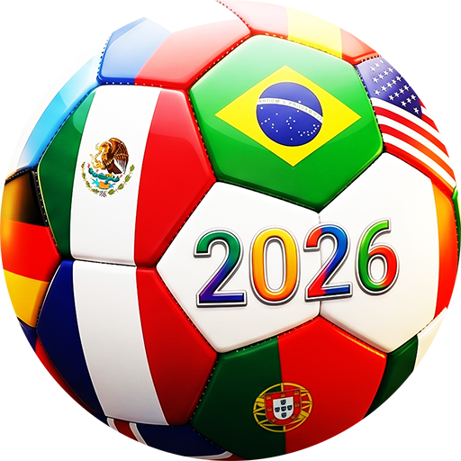

# TantoSec World Cup 2026 Prediction League Bot



A Slack bot for running an internal World Cup 2026 prediction league. Players predict match scores, make tournament picks, and earn points throughout the tournament. Everything is scored and announced automatically.

## Features

- **Match predictions** — predict scores before each kickoff, editable any time until kickoff
- **Tournament picks** — winner, golden boot, semi-finalists, zebra underdog, group stage goals total
- **Auto scoring** — matches scored within one poll cycle of finishing
- **Kickoff reminders** — channel reminder ~1 hour before each match, tagging unpredicted players
- **Kickoff announcements** — all predictions revealed the moment a match kicks off, with venue and city
- **Goal notifications** — live alert within ~10 seconds of every goal, with scorer name, minute, and current standings
- **Halftime notifications** — halftime summary with scorers, possession/shots stats, and prediction standings
- **Win probabilities** — live betting odds shown in every match message (predict modal, reminders, kickoff, goals, results)
- **Underdog detection** — automatically identifies the underdog using betting odds (≥15% win probability gap) with FIFA rankings as fallback
- **Live fixtures** — `/fixtures` shows in-progress matches with current score and everyone's predictions
- **Result summaries** — full-time result posted to channel with goalscorer recap, possession and shots stats, everyone's predictions, points, and top 10 leaderboard
- **Personal DMs** — each player gets a DM with their points and rank after every match
- **Matchday wraps** — end-of-day summary with all results and top earners
- **Phase wraps** — rich announcement after each round completes (group stage, R32, R16, QF, SF, Final) with full leaderboard
- **Picks reveal** — all tournament picks posted publicly when picks lock
- **Leaderboard** — live standings available any time
- **Player stats** — full prediction history and picks visible per player via `/mystats @user`
- **Auto-picks** — LLM-generated predictions for players who forget, applied at kickoff, so nobody is missing from the board. Uses Pollinations AI by default (no account required); Groq and Google Gemini supported as drop-in replacements. Auto-picks are labelled 🤖 everywhere they appear and count for full points.

## Scoring

### Match Predictions
| Result | Points |
|--------|--------|
| Exact score | 9 pts |
| Correct result (W/D/L) | 3 pts |
| Upset bonus (predicted the underdog wins — and they did) | +2 pts |

**Knockout multipliers:** ×1.5 (R32/R16) · ×2 (QF) · ×2.5 (SF/3rd) · ×3 (Final)

**How is the underdog determined?**
Live betting odds are used — the team with the lower win probability is the underdog, but only when the gap is ≥15 percentage points (closer matches are too ambiguous to call). When odds aren't available yet, FIFA rankings are used as a fallback (gap ≥15 positions). A draw does **not** trigger the upset bonus — you need to predict the underdog wins outright.

### Tournament Picks _(lock time configurable via `PICKS_LOCK_TIME`)_
| Pick | Points |
|------|--------|
| World Cup Winner | 30 pts |
| Golden Boot (top scorer) | 30 pts |
| Semi-finalists (×4) | 15 pts each |
| Group Stage Total Goals | 25 pts (closest) / 10 pts (within ±5) |
| Zebra Pick — Bold tier | 10–80 pts depending on how far they go |
| Zebra Pick — Wildcard tier | ×2 all zebra points |

### Auto-picks 🤖
Players who forget to predict a match or miss the tournament picks deadline are automatically covered by the LLM auto-pick system.

- **Match predictions** — generated once per match at the ~1h kickoff reminder and cached. Applied to all missing players at kickoff so the full predictions board is always complete. Each player gets a DM explaining the pick and the reasoning.
- **Tournament picks** — generated once at the ~1h tournament picks lock reminder. Applied to all players who haven't submitted when picks lock. Each player gets a DM with their full auto-generated picks.
- **Fairness** — all players who missed the same match get the identical LLM-generated pick (one LLM call per match, not per player). Nobody gets a different result by accident.
- **Display** — auto-picks are labelled 🤖 in the kickoff message, `/mystats`, and `/picks`. They count for full points.
- **Fallback** — if the LLM fails all retries, an odds-based pick is used instead (favourite wins 1–0, or 0–0 for a draw). The 🤖 label still applies.

## Commands

| Command | Description |
|---------|-------------|
| `/register` | Join the prediction league |
| `/picks` | Set tournament picks (locks 18 Jun) |
| `/predict` | Predict match scores — pick a date, fill in scores |
| `/leaderboard` | Current standings |
| `/fixtures` | Upcoming fixtures + live matches with all predictions during games |
| `/results` | Recent results with your points |
| `/scoring` | Full scoring rules |
| `/mystats` | Your personal stats and picks — `/mystats @user` to view someone else |
| `/help` | List all commands |

## Stack

- **Python 3.12** with [slack-bolt](https://github.com/slackapi/bolt-python) in Socket Mode
- **SQLite** with WAL mode for persistence
- **APScheduler** for background jobs (scoring, reminders, wraps, odds sync)
- **ESPN unofficial API** — no key required, near-real-time scores, goal scorers, match stats, venue info
- **The Odds API** free tier for live betting odds and win probabilities (500 req/month — synced every 6 hours)
- **Docker** + Docker Compose for deployment

## Setup

### 1. Create the Slack App

Go to [api.slack.com/apps](https://api.slack.com/apps) → **Create New App** → **From a manifest** → paste `manifest.yaml`.

Then:
- **OAuth & Permissions** → **Install to Workspace** → copy the `xoxb-` bot token
- **Basic Information** → **App-Level Tokens** → create token with `connections:write` scope → copy the `xapp-` token

### 2. Set the bot icon _(optional)_

Go to [api.slack.com/apps](https://api.slack.com/apps) → your app → **Basic Information** → **Display Information** → upload `worldcup.png` as the App Icon.

### 3. Get an Odds API key

Go to [the-odds-api.com](https://the-odds-api.com) → sign up for a free account → copy your API key.

The free tier gives 500 requests/month. The bot syncs odds every 6 hours (~120 requests for the full tournament).

### 4. Configure environment

```bash
cp .env.example .env
```

Edit `.env`:

```env
SLACK_BOT_TOKEN=xoxb-...
SLACK_APP_TOKEN=xapp-...
ODDS_API_KEY=your-key-here            # free at the-odds-api.com
RESULTS_CHANNEL=C0XXXXXXXXX           # Slack channel ID for #worldcup-2026
DISPLAY_TIMEZONE=Australia/Sydney     # timezone for kickoff times
LIVE_POLL_INTERVAL=10                 # seconds between live score syncs (default: 10)
POLL_INTERVAL=60                      # seconds between other job cycles (default: 60)
ORG_NAME=TantoSec                     # organisation name shown in messages

# Auto-pick — optional, defaults shown
AUTO_PICK_ENABLED=true                # set to false to disable entirely
LLM_PROVIDER=pollinations             # pollinations (default) | groq | google
# GROQ_API_KEY=                       # required if LLM_PROVIDER=groq
# GOOGLE_AI_API_KEY=                  # required if LLM_PROVIDER=google
# PICKS_LOCK_TIME=2026-06-18T18:00:00 # override picks lock time (UTC ISO 8601)
                                      # omit to lock at first match kickoff
```

### 5. Invite the bot to the channel

In Slack, run `/invite @WC 2026 Bot` in your results channel.

### 6. Deploy

```bash
docker compose up -d
docker compose logs -f
```

The bot initializes the database, imports all 104 fixtures from ESPN, and starts listening on first run.

## Project Structure

```
app/
├── main.py              # Slack app, command registration, entry point
├── db.py                # SQLite schema and all queries
├── scheduler.py         # APScheduler jobs (scoring, reminders, wraps, odds sync)
├── espn.py              # ESPN API client — fixtures, live scores, goal scorers, stats
├── football.py          # Score and time formatting utilities
├── odds.py              # The Odds API client, win probability calculation, underdog detection
├── scoring.py           # Points calculation logic
├── autopick.py          # LLM auto-pick logic — generates, caches, and applies picks
├── players.py           # Player search for golden boot autocomplete
├── players.json         # 1,249 WC 2026 squad players
├── flags.py             # Country flag emoji map
├── fifa_rankings.py     # Official June 2026 FIFA rankings (underdog fallback)
├── llm/
│   ├── __init__.py      # get_provider() factory + startup validation
│   ├── base.py          # LLMProvider protocol
│   ├── pollinations.py  # Pollinations AI (default, no key required)
│   ├── groq.py          # Groq stub (set LLM_PROVIDER=groq + GROQ_API_KEY)
│   ├── google.py        # Google Gemini stub (set LLM_PROVIDER=google + GOOGLE_AI_API_KEY)
│   └── fallback.py      # Odds-based fallback when all LLM attempts fail
└── handlers/
    ├── predict.py       # /predict — dynamic date picker modal
    ├── picks.py         # /picks — tournament picks modal
    ├── enroll.py        # /register
    ├── leaderboard.py   # /leaderboard
    ├── fixtures.py      # /fixtures
    ├── results.py       # /results
    ├── scoring.py       # /scoring
    ├── me.py            # /mystats
```

## Deployment Notes

- Runs over Socket Mode — no public IP or open ports required, any machine with internet access works
- SQLite database is persisted via Docker volume at `./data/worldcup.db`
- Live score sync (`live_updates`) runs every `LIVE_POLL_INTERVAL` seconds (default 10s) — ESPN has no rate limits
- Other jobs (scoring, kickoff announcements, reminders) run every `POLL_INTERVAL` seconds (default 60s)
- Odds sync runs every 6 hours regardless of `POLL_INTERVAL` to conserve API credits
- Odds are frozen at kickoff — only `SCHEDULED`/`TIMED` matches are updated
- Knockout matches with TBD teams are skipped during sync and added automatically once teams are confirmed
- Times displayed in `DISPLAY_TIMEZONE` (default: `Australia/Sydney`)
- DB schema changes are applied directly via `ALTER TABLE` on the production database — no migration logic in code
- Auto-pick LLM calls happen at the ~1h kickoff reminder (not at kickoff) — by the time the match starts the result is cached, so kickoff messages are never delayed
- With `LLM_PROVIDER=pollinations` (default) no API key is needed — the provider allows 1 queued request per IP with ~5–20s response time, which is well within the 1-hour window
- Switching LLM providers requires only changing `LLM_PROVIDER` and adding the corresponding key — no code changes needed
- Set `PICKS_LOCK_TIME` when deploying mid-tournament; leave it unset for a clean deploy before the competition starts
